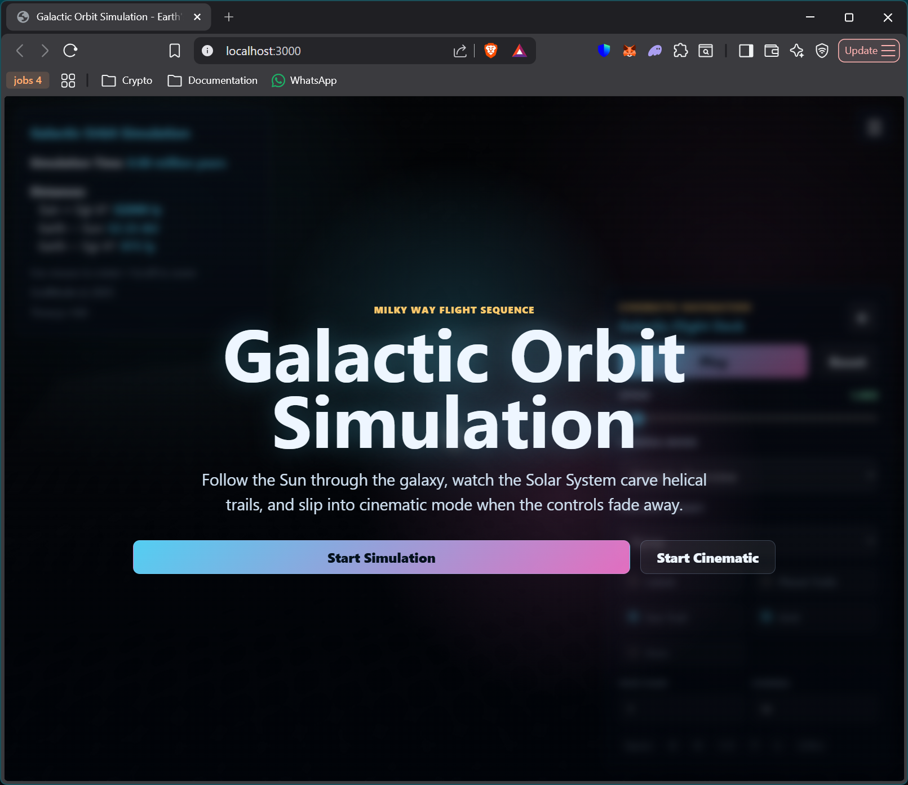
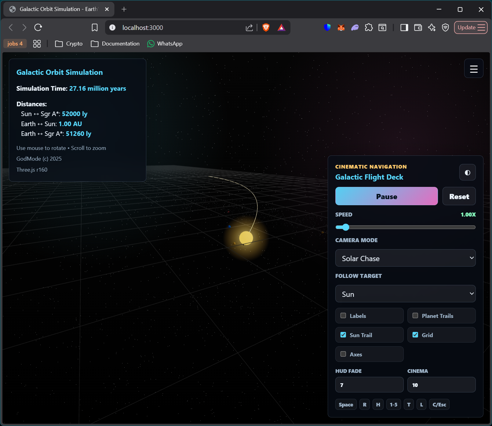

# Galactic Orbit Simulation

A 3D visualization of the solar system's helical paths as the Sun orbits Sagittarius A*, the supermassive black hole at the center of the Milky Way. The simulation now includes all 8 major planets and their tilted orbits.

## Screenshots


*Landing Page*


*Simulation View*

## Installation

```bash
npm install
```

## Development

Start the development server with hot reload:

```bash
npm run dev
```

The application will automatically open in your browser at `http://localhost:3000`.

## Build

Create a production bundle:

```bash
npm run build
```

Preview the production build locally:

```bash
npm run preview
```

## Technologies

- **Three.js** - 3D graphics library
- **Vite** - Modern build tool with ES6 module support
- **JavaScript ES6** - Modern JavaScript syntax

## Features Implemented

### Phase 2: Galactic Orbit System
- **Sagittarius A* (Galactic Center)**: Visualized as a bright purple marker at the origin
- **Sun's Galactic Orbit**: The Sun orbits around Sagittarius A* in a circular path
  - Orbit radius: 400 units (scaled representation of ~26,000 light-years)
  - Orbital period: 120 seconds (scaled representation of ~225 million years)
  - The Sun travels at approximately 828,000 km/h in reality, scaled proportionally
- **Time Scaling**: Real-time simulation where 1 second = ~1.875 million years
- **Camera Controls**: Use mouse to orbit, scroll to zoom (max distance increased to 1500 units to view full galactic orbit)

### Phase 3: Earth's Helical Orbit
- **Earth's Orbit Around Sun**: Earth now orbits the moving Sun in a circular path
  - Orbit radius: 15 units (representing 1 AU / ~150 million km)
  - Orbital period: 2.5 seconds (time-scaled for visualization)
- **Helical Path**: As Earth circles the moving Sun while the Sun orbits Sagittarius A*, Earth traces a helix (corkscrew) through space
  - Approximately 48 complete Earth orbits occur during one 120-second galactic orbit
  - The helix becomes more apparent when viewing from above or from the side
- **Time Scaling Rationale**: Earth's period is intentionally 10.8 million times faster than reality (2.5 seconds vs 365.25 days) to make the helical path visible during animation, rather than matching the galactic time scale
- **Visualization**: Currently in the same orbital plane as the galactic orbit; 60-degree ecliptic tilt comes in the next phase
 - **Ecliptic Tilt**: Earth's orbital plane is tilted 60° relative to the galactic plane (XZ), creating a realistic tilted corkscrew path as described in the original concept. A galactic grid helper (XZ plane) is provided in the scene for reference.

### Astronomical Accuracy
- Real galactic orbit radius: ~26,000 light-years from Sagittarius A*
- Real galactic orbital period: ~225 million years
- Scaling factor: 1 unit ≈ 65 light-years
- Time compression: 1,875,000:1 ratio

### Earth Orbit Scaling
- Real Earth orbital radius: 1 AU (~150 million km)
- Real Earth orbital period: 365.25 days
- Earth orbit time compression: 10,886,400:1 ratio (365.25 days / 2.5 seconds)
- Note: Earth's time scale is intentionally faster than the galactic time scale (10.8M:1 vs 1.875M:1) to make the helical path visible during animation

### Phase 4: Interactive Controls System
- **SimulationControls Class**: Modular control system for play/pause, speed adjustment, and camera presets
- **Time Speed Multiplier**: 0x - 20x speed control via slider (0x = paused, 1x = realtime, 20x = turbo)
- **Play/Pause Toggle**: Pause/resume simulation independently of speed setting
- **Camera Presets**: Quick navigation to key viewpoints:
  - **Follow Earth**: Third-person chase camera tracking Earth's motion (key: 1)
  - **Follow Sun**: Overhead view of Sun's galactic orbit (key: 2)
  - **Galactic View**: Wide overview showing full galactic orbit with Earth as a trail (key: 3)
- **Reset Button**: Returns simulation to initial state (t=0, speed 1x, galactic view)
- **Control Panel UI**: Bottom-right positioned interactive controls with real-time status display
- **Smooth Camera Following**: Lerp-based smooth camera tracking when following Earth or Sun

### Phase 5: Visual Effects and Information Display
- **Earth Orbital Trail**: 800-point circular buffer trail in cyan (#00ffff) at 70% opacity
  - Updated every frame as Earth moves to create visible helical path
  - BufferGeometry implementation for efficient rendering
  - Automatically clears old trail segments to prevent memory growth
- **CSS2D Labels**: Overlay text labels for celestial bodies (non-geometric approach)
  - **Sun**: ☀ #ffaa00 (golden)
  - **Earth**: 🜨 #1e90ff (dodger blue)
  - **Sagittarius A***: ★ #aa00ff (purple)
  - CSS2DRenderer ensures labels follow world positions and appear above 3D objects
- **Starfield**: 8000 random points distributed on a sphere (radius 5000 units)
  - Creates immersive cosmic environment background
  - PointsMaterial with white color (#ffffff) at 70% opacity
  - Represents distant stars in the Milky Way
- **Dynamic Information Panel**: Real-time updates of simulation metrics
  - **Simulation Time**: Elapsed time in millions of years
  - **Sun ↔ Sagittarius A***: Distance in light-years
  - **Earth ↔ Sun**: Distance in AU (Astronomical Units)
  - **Earth ↔ Sagittarius A***: Distance in light-years
  - Three.js version display (r[VERSION])
- **Enhanced Materials**:
  - **Sun**: Increased emissiveIntensity from 0.6 to 1.0 (brighter glow), added metalness 0.2 (reflective surface)
  - **Earth**: Added metalness 0.3 and roughness 0.7 (realistic diffuse reflection with slight specularity)
- **CSS2DRenderer Integration**: Rendered alongside WebGLRenderer in a non-interactive overlay for efficient label positioning

### Phase 6: Multi-Planet Solar System
- **All 8 Planets**: Mercury, Venus, Earth, Mars, Jupiter, Saturn, Uranus, Neptune
  - Accurate orbital parameters: semi-major axis (AU), eccentricity, period (years)
  - Earth's eccentricity corrected to 0.0167 (previously 0)
  - Visual scaling: 1 AU = 15 scene units
- **Elliptical Orbits**: All planets use accurate ellipse equations with individual eccentricities
- **Visual Period Compression**: Outer planets use formula `1 + 3 * P^0.6` to compress periods
  - Mercury: ~2.0s, Earth: ~4.0s, Jupiter: ~11.5s, Neptune: ~31.8s
  - Prevents outer planets from being imperceptibly slow while keeping inner planets visible
- **Individual Trails**: Each planet renders a colored trail (800 points) showing its helical path
- **Planet Labels**: CSS2D labels with Unicode symbols (☿ ♀ ♁ ♂ ♃ ♄ ♅ ♆) and names
- **Realistic Sizes**: Planet sphere radii scaled by actual planetary radii (Jupiter/Saturn larger)
- **60° Ecliptic Tilt**: All planetary orbits tilted relative to galactic plane

### Coming Next
- Moon orbits for Earth and other planets
- Asteroid belt visualization
- Toggle individual planet trails on/off

## Project Structure

- `index.html` - Main HTML entry point
- `app.js` - Application bootstrap and module coordinator
- `styles.css` - Global styles
- `src/` - Modular JavaScript components
  - `scene.js` - Three.js scene setup, animation loop, and module orchestration
  - `galacticOrbit.js` - Galactic orbit visualization and Sun positioning
  - `earthOrbit.js` - Earth's orbit around the Sun with ecliptic tilt support
  - `coordinateTransforms.js` - Coordinate system transformations and ecliptic tilt mathematics
  - `controls.js` - Simulation control system (speed, play/pause, camera presets, reset)
  - `visualEffects.js` - Visual enhancements: trails, CSS2D labels, starfield, info panel updates
    - `planetOrbits.js` - Planet data (8 planets), visual period calculation, generalized PlanetOrbit class
    - `earthOrbit.js` - (Legacy) Single-planet EarthOrbit implementation; superseded by `planetOrbits.js` for multi-planet support

## Future Features

- Planetary detail mode (close-up visualizations)
- Historical orbit path visualization
- Astronomical data accuracy improvements
- Performance optimizations for larger starfield counts
- Mobile touch controls for camera manipulation
- Accurate astronomical calculations and ephemeris data
- Per-frame performance optimization for 60+ FPS rendering
- Additional celestial bodies (planets, moons) with their orbital mechanics

## Technical Notes

### Coordinate Transformations
- The `coordinateTransforms.js` module provides rotation matrix utilities to apply the 60-degree ecliptic tilt to Earth's orbital plane relative to the galactic XZ plane (Y=0).
- The function `applyEclipticTilt(offsetVector, tiltDegrees)` returns a new `THREE.Vector3` rotated around the X-axis by the specified tilt. This keeps the orbit mechanics pure and reusable.
- A `GridHelper` representing the galactic plane (XZ) and an `AxesHelper` are added to the scene to visually verify the tilt.

The grid helper can be toggled in future UI enhancements (see upcoming `controls.js` work).

### Visual Period Compression Formula
Outer planets have extremely long orbital periods (Neptune: 164.79 years) that would be imperceptible in real-time simulation. The formula `visualPeriod = 1 + 3 * Math.pow(realPeriodYears, 0.6)` compresses these periods while maintaining relative speed differences:
- Exponent 0.6 provides sublinear scaling (slower growth than linear)
- Constant 1 ensures minimum 1-second period
- Multiplier 3 balances visibility across all planets

This allows viewers to observe all planetary helices simultaneously without waiting minutes for outer planet orbits.
